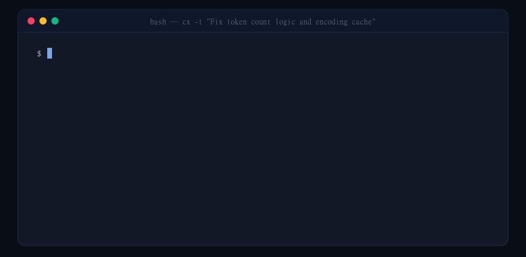
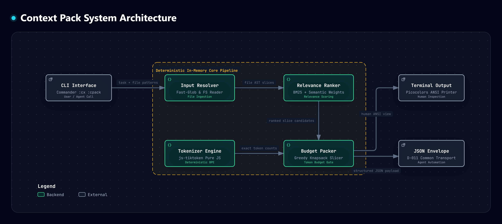

<p align="center">
  
  <br />
  <sub>Context Pack - Nén và đóng gói ngữ cảnh mã nguồn theo trần token cho AI Coding Agents</sub>
</p>

<h1 align="center">Context Pack</h1>

<p align="center">
  <strong>Hạ tầng đóng gói và trích xuất lát cắt context mã nguồn theo trần ngân sách token xác định</strong>
</p>

<p align="center">
  <a href="README.md">English</a> • <a href="README.vi.md">Tiếng Việt</a>
  <br />
  <a href="docs/SPEC.md">Đặc tả kỹ thuật (Spec)</a> •
  <a href="docs/BENCHMARK_RESULTS.md">Báo cáo Benchmark</a>
</p>

<p align="center">
  
  = 18.0.0" />
  
  
  
  
</p>

<p align="center">
  
  <br />
  <sub>Hình 1: Đóng gói và trích xuất lát cắt context theo trần token xác định trong terminal.</sub>
</p>

---

## Mục lục
1. [Giới thiệu tổng quan](#giới-thiệu-tổng-quan)
2. [Vì sao nên dùng Context Pack?](#vì-sao-nên-dùng-context-pack)
3. [Kiến trúc hệ thống](#kiến-trúc-hệ-thống)
4. [Cài đặt và thiết lập](#cài-đặt-và-thiết-lập)
5. [Hướng dẫn sử dụng CLI](#hướng-dẫn-sử-dụng-cli)
   - [Cú pháp cơ bản](#1-cú-pháp-cơ-bản-cx-hoặc-context-pack)
   - [Bảng tham số dòng lệnh](#2-bảng-tham-số-dòng-lệnh)
   - [Chế độ xuất JSON cho máy đọc](#3-chế-độ-xuất-json-cho-máy-đọc)
6. [Sử dụng dưới dạng thư viện SDK TypeScript](#sử-dụng-dưới-dạng-thư-viện-sdk-typescript)
7. [Cấu trúc Transport Envelope chuẩn hóa](#cấu-trúc-transport-envelope-chuẩn-hóa)
8. [Mô hình lỗi và Exit Codes xác định](#mô-hình-lỗi-và-exit-codes-xác-định)
9. [Bảng encoding được hỗ trợ](#bảng-encoding-được-hỗ-trợ)
10. [Kết quả đo kiểm hiệu năng (Benchmark)](#kết-quả-đo-kiểm-hiệu-năng-benchmark)
11. [Câu hỏi thường gặp (FAQ)](#câu-hỏi-thường-gặp-faq)
12. [Quy trình phát triển và kiểm thử](#quy-trình-phát-triển-và-kiểm-thử)
13. [Giấy phép sử dụng](#giấy-phép-sử-dụng)

---

## Giới thiệu tổng quan

`context-pack` là công cụ dòng lệnh (CLI) và bộ thư viện TypeScript SDK cục bộ (local-first), được xây dựng nhằm giải quyết bài toán loãng chú ý (prompt dilution) và cạn kiệt ngân sách token trong các luồng làm việc của AI coding agent (ví dụ: Cursor, Continue, Claude Code, GitHub Copilot).

Thay vì nạp toàn bộ hàng ngàn dòng mã nguồn thô vào cửa sổ ngữ cảnh (context window) của mô hình ngôn ngữ lớn (LLM), `context-pack` duyệt qua các tệp mã nguồn mục tiêu, chấm điểm mức độ liên quan của từng đoạn mã dựa trên yêu cầu nhiệm vụ bằng thuật toán BM25 / TF-IDF, và sử dụng giải thuật Knapsack tham lam để gói gọn các đoạn mã đắt giá nhất vào một gói ngữ cảnh mà không bao giờ vượt quá trần token cho phép.

---

## Vì sao nên dùng Context Pack?

- **Tiết kiệm token vượt trội (-75.2%)**: Ngăn ngừa hiện tượng loãng sự chú ý của LLM và giảm chi phí suy luận bằng cách trích xuất các đoạn mã trọng tâm thay vì nạp toàn bộ tệp thô.
- **100% Cục bộ & Bảo mật mã nguồn**: Hoạt động hoàn toàn trong bộ nhớ máy tính cục bộ. Không gửi dữ liệu qua mạng, không telemetry, không nguy cơ rò rỉ mã nguồn dự án ra bên ngoài.
- **Tokenizer thuần JavaScript**: Được phát triển trên nền `js-tiktoken`, không phụ thuộc vào các module biên dịch C++ native (Node-GYP) hay WebAssembly (WASM), vận hành ổn định trên Windows, macOS và Linux.
- **Thuật toán Knapsack tất định**: Xử lý logic hòa điểm (tie-breaking) hoàn toàn xác định. Các tệp đầu vào, mô tả nhiệm vụ và mức ngân sách giống nhau sẽ luôn tạo ra kết quả giống nhau 100%.
- **Cấu trúc JSON Envelope chuẩn hóa**: Cung cấp chế độ `--json` định dạng sẵn schema cho các hệ thống điều phối đa agent (multi-agent orchestration).
- **Lệnh tắt siêu ngắn (`cx`)**: Hỗ trợ trực tiếp cờ lệnh (`cx -t "..." -f "..." -b 1000`) cùng khả năng tương thích ngược các lệnh con truyền thống.

---

## Kiến trúc hệ thống

<p align="center">
  
  <br />
  <sub>Hình 2: Luồng thực thi 4 tầng trong bộ nhớ và cơ chế đóng gói tất định.</sub>
</p>

### Quy trình xử lý 4 giai đoạn

1. **Input Resolver**: Tiếp nhận đường dẫn tệp hoặc mẫu glob (ví dụ: `src/**/*.ts`), đọc nội dung tệp vào bộ nhớ và khởi tạo các ứng viên lát cắt mã nguồn.
2. **Relevance Ranker**: Tính toán tần suất xuất hiện và phân bổ trọng số từ khóa (BM25 + TF-IDF) giữa bản mô tả nhiệm vụ với từng cửa sổ dòng mã.
3. **Tokenizer Engine**: Đo lường số lượng token chuẩn xác tuyệt đối bằng thuật toán BPE thuần JS (`cl100k_base`, `o200k_base`, `p50k_base`, `r50k_base`).
4. **Budget Packer**: Ứng dụng giải thuật Knapsack đóng gói các lát cắt có điểm liên quan cao nhất, bảo đảm tổng số token luôn nằm trong giới hạn ngân sách.

---

## Cài đặt và thiết lập

### Chạy trực tiếp qua `npx` (Không cần cài đặt)

```bash
npx ai-context-pack -t "Fix token count logic" -f "src/**/*.ts" -b 1000
```

### Cài đặt toàn cục (Khuyến nghị cho công việc hàng ngày)

Cài đặt một lần duy nhất để sử dụng lệnh tắt siêu ngắn **`cx`** ở bất kỳ thư mục nào:

```bash
npm install -g ai-context-pack

# Kiểm tra cài đặt
cx --help
```

### Cài đặt làm dependency trong dự án

```bash
npm install -D ai-context-pack
```

---

## Hướng dẫn sử dụng CLI

Bạn có thể sử dụng tên lệnh ngắn **`cx`**, hoặc các bí danh **`cpack`**, **`context-pack`**, và **`ai-context-pack`**.

### 1. Cú pháp cơ bản (`cx` hoặc `context-pack`)

```bash
# Sử dụng trực tiếp với các cờ
cx -t "Fix user session invalidation" -f "src/auth/**/*.ts" "src/user.ts" -b 2000

# Hoặc dùng với lệnh con tường minh
cx pack --task "Refactor tokenizer" --files "src/tokenizer.ts" --budget 1500
```

### 2. Bảng tham số dòng lệnh

| Tham số | Viết tắt | Mặc định | Mô tả |
|---|---|---|---|
| `--task <text>` | `-t` | *(Bắt buộc)* | Mô tả nhiệm vụ hoặc hướng dẫn cần thực hiện |
| `--files <globs...>` | `-f` | *(Bắt buộc)* | Danh sách đường dẫn tệp hoặc mẫu glob |
| `--budget <number>` | `-b` | `4000` | Mức trần ngân sách token tối đa |
| `--encoding <name>` | | `cl100k_base` | Bảng mã tokenizer BPE tiktoken |
| `--max-slice-lines <n>` | | `100` | Số dòng tối đa cho mỗi lát cắt mã nguồn |
| `--min-relevance <n>` | | `0` | Ngưỡng điểm liên quan tối thiểu (0.0 đến 1.0) |
| `--output <file>` | `-o` | | Đường dẫn tệp ghi payload JSON kết quả |
| `--json` | | `false` | Xuất định dạng JSON có cấu trúc ra stdout |
| `--help` | `-h` | | Hiển thị bảng trợ giúp và hướng dẫn |
| `--version` | `-V` | | Hiển thị phiên bản phần mềm |

### 3. Chế độ xuất JSON cho máy đọc

Thêm cờ `--json` để truyền trực tiếp payload vào đường ống dẫn dữ liệu hoặc cho agent tự động xử lý:

```bash
cx -t "Fix token count logic" -f "src/tokenizer.ts" -b 1000 --json
```

---

## Sử dụng dưới dạng thư viện SDK TypeScript

Gói `ai-context-pack` cung cấp đầy đủ kiểu dữ liệu TypeScript (types) cho các ứng dụng Node.js:

```typescript
import { pack } from 'ai-context-pack';

const result = await pack({
  task: 'Fix token count logic and encoding validation',
  files: ['src/tokenizer.ts', 'src/packer.ts'],
  budget: 1000,
  encoding: 'cl100k_base',
  maxSliceLines: 100,
  minRelevance: 0.1,
});

console.log(`Đã dùng ${result.data.used_tokens} trên ${result.data.budget_tokens} tokens`);
for (const slice of result.data.slices) {
  console.log(`- ${slice.file} (dòng ${slice.start_line}-${slice.end_line}) | ${slice.tokens} tokens`);
}
```

---

## Cấu trúc Transport Envelope chuẩn hóa

Khi chạy với cờ `--json` hoặc gọi hàm SDK `pack()`, Context Pack trả về một đối tượng JSON có cấu trúc chuẩn hóa:

```json
{
  "data": {
    "task": "Fix token count logic",
    "budget_tokens": 1000,
    "used_tokens": 953,
    "slice_count": 2,
    "file_count": 2,
    "truncated": true,
    "next_cursor": null,
    "slices": [
      {
        "file": "src/packer.ts",
        "start_line": 1,
        "end_line": 100,
        "tokens": 709,
        "relevance_score": 0.65,
        "content": "// Nội dung đoạn mã nguồn..."
      },
      {
        "file": "src/tokenizer.ts",
        "start_line": 1,
        "end_line": 32,
        "tokens": 244,
        "relevance_score": 0.52,
        "content": "// Nội dung đoạn mã nguồn..."
      }
    ]
  },
  "metadata": {
    "tool": "context-pack",
    "schema_version": "1.0",
    "duration_ms": 233
  }
}
```

---

## Mô hình lỗi và Exit Codes xác định

Context Pack quy định các mã thoát tiến trình xác định, phù hợp cho việc tích hợp vào shell script và CI pipeline:

| Exit Code | Tên định danh | Ý nghĩa |
|---|---|---|
| `0` | Success | Tác vụ hoàn thành thành công |
| `1` | General Failure | Lỗi runtime nội bộ hoặc sự cố không mong muốn |
| `2` | Invalid Input | Sai cú pháp tham số hoặc ngân sách không hợp lệ |
| `3` | Not Found | Đường dẫn tệp hoặc mẫu glob không khớp với tệp nào |
| `4` | Permission Denied | Không có quyền đọc tệp trên hệ thống |
| `5` | Dependency Unavailable | Khởi tạo bảng mã tokenizer thất bại |

Khi bật chế độ `--json`, thông tin lỗi sẽ được đóng gói thành error envelope xuất ra stdout trước khi thoát:

```json
{
  "error": {
    "code": "INVALID_INPUT",
    "message": "Budget must be a valid integer."
  },
  "metadata": {
    "schema_version": "1.0"
  }
}
```

---

## Bảng encoding được hỗ trợ

Context Pack hỗ trợ đầy đủ các bảng mã tokenizer BPE phổ biến của hệ sinh thái OpenAI:

| Bảng mã | Các dòng model chủ đạo |
|---|---|
| `cl100k_base` *(Mặc định)* | GPT-4, GPT-4 Turbo, GPT-3.5 Turbo, text-embedding-ada-002 |
| `o200k_base` | GPT-4o, GPT-4o mini, o1-preview, o1-mini |
| `p50k_base` | Các dòng Codex, text-davinci-002, text-davinci-003 |
| `r50k_base` | Text-davinci-001, davinci, curie, babbage, ada |

---

## Kết quả đo kiểm hiệu năng (Benchmark)

Thực nghiệm đo lường đối chiếu với phương pháp nạp toàn bộ tệp thô trên codebase `ai-token-diff` (4,630 tokens gốc, ngân sách trần đặt ở mức 1,200 tokens):

| Mô tả nhiệm vụ | Toàn bộ tệp (B0) | Context Pack (B2) | Mức cắt giảm | Độ trễ | Lát cắt |
|---|:---:|:---:|:---:|:---:|:---:|
| Sửa phân tích cú pháp cờ --encoding trong CLI | 4,630 | 1,188 | **-74.3%** | 47ms | 3 |
| Thêm xử lý lỗi khi thiếu tệp đầu vào | 4,630 | 1,188 | **-74.3%** | 16ms | 3 |
| Tái cấu trúc module tokenizer hỗ trợ đa encoding | 4,630 | 969 | **-79.1%** | 15ms | 4 |
| Viết unit test cho module formatter | 4,630 | 1,188 | **-74.3%** | 15ms | 3 |
| Giải thích kiến trúc đếm token | 4,630 | 1,188 | **-74.3%** | 15ms | 3 |

- **Mức tiết kiệm token trung bình**: **-75.2%**
- **Độ trễ trung bình**: **21.4ms**
- **Tài nguyên cục bộ**: 100% trong bộ nhớ, không tốn độ trễ mạng.

> *Xem chi tiết phương pháp và kết quả tại [Báo cáo Benchmark](docs/BENCHMARK_RESULTS.md).*

---

## Câu hỏi thường gặp (FAQ)

#### Context Pack có cần kết nối mạng hay API key không?
Không. Context Pack hoạt động 100% offline trên máy cục bộ của bạn, không cần bất kỳ API key hay đường truyền mạng nào.

#### Tôi có thể dùng ký tự đại diện và mẫu glob không?
Có. Bạn có thể sử dụng các mẫu glob như `src/**/*.ts` hay `components/**/*.tsx`. Context Pack sử dụng thư viện `fast-glob` để duyệt tệp hiệu năng cao.

#### Thuật toán xếp hạng hoạt động như thế nào?
Context Pack kết hợp đánh trọng số từ khóa BM25 và TF-IDF để đối chiếu giữa câu lệnh nhiệm vụ và các đoạn mã. Thuật toán ưu tiên các khối khai báo hàm, exported symbols và tệp chứa nhiều từ khóa liên quan nhất.

#### Context Pack có can thiệp hay sửa đổi tệp mã nguồn của tôi không?
Không. Context Pack hoàn toàn chỉ đọc (read-only). Công cụ duyệt mã nguồn, trích xuất các dải dòng phù hợp và xuất kết quả ra stdout hoặc tệp JSON theo yêu cầu.

---

## Quy trình phát triển và kiểm thử

### Yêu cầu môi trường
- Node.js >= 18.0.0
- npm >= 9.0.0

### Thiết lập tại máy cục bộ

```bash
# Clone kho lưu trữ
git clone https://github.com/Khoa180806/context-pack.git
cd context-pack

# Cài đặt thư viện
npm install

# Chạy bộ kiểm thử
npm test

# Biên dịch mã nguồn TypeScript
npm run build
```

### Các lệnh kiểm tra chất lượng

```bash
# Biên dịch và kiểm tra kiểu
npm run build

# Chạy kiểm thử tự động (Vitest)
npm test

# Kiểm tra cú pháp (Linter)
npm run lint
```

---

## Giấy phép sử dụng

Dự án được phân phối dưới giấy phép **MIT License**. Xem chi tiết tại tệp [LICENSE](LICENSE).
